# 基于 GRPO 及其改良算法的数学推理模型对齐方式研究

## 概述

大语言模型在数学推理任务上的表现高度依赖于有效的对齐训练。传统的基于人类反馈的强化学习（RLHF）方法需要训练独立的价值网络（Critic Model），增加了计算复杂度和训练不稳定性。Group Relative Policy Optimization（GRPO）作为一种无需 Critic 的强化学习对齐方法，通过对同一提示生成的多条补全结果进行组内相对优势归一化，简化了训练流程。在此基础上，Lin 等人提出 Confidence-based Pruning Policy Optimization（CPPO），通过剪枝低置信度样本来进一步加速 GRPO 训练。

本研究的核心思路是采用**基线—消融—泛化**的实验范式，系统评估 GRPO 及其改进在数学推理对齐任务中的效果：

1. **基线建立**：首先以结果奖励（Result-only）模式在 GSM8K 数据集上跑通标准 GRPO 微调，作为性能基线；
2. **消融验证**：在 GSM8K 上依次引入过程奖励（PRM 步骤评分）和 CPPO 剪枝机制，通过消融实验分别量化二者对训练效果的影响；
3. **泛化测试**：以 GSM8K 为核心 benchmark，同时在 MATH 等数据集上评估模型的跨数据集泛化能力。

项目基于 Qwen2.5-1.5B-Instruct 模型，设计了配套的两阶段训练策略：首先通过监督微调（SFT）训练过程奖励模型（PRM）和参考基线模型，然后使用 GRPO/CPPO 算法对策略模型进行强化学习对齐。此外还利用了 CMATH、DeepMath-103K 等数据集辅助 PRM 训练。

本项目地址如下：https://github.com/xsxmt0721/Qwen-Math-GRPO


## 相关研究

### GRPO

GRPO（Group Relative Policy Optimization）是 DeepSeek-R1 中提出的一种强化学习对齐算法，其核心思想是摒弃传统 PPO 中独立的 Critic 网络，转而通过对同一提示生成的 $K$ 条补全进行组内比较来估计优势函数。

给定一个提示 $q$，策略模型 $\pi_\theta$ 生成 $K$ 条补全 $\{o_1, o_2, \ldots, o_K\}$，每条补全对应一个奖励值 $\{r_1, r_2, \ldots, r_K\}$。GRPO 的组内相对优势（group-relative advantage）定义为：

$$\hat{A}_{i} = \frac{r_i - \text{mean}(\{r_1, \ldots, r_K\})}{\text{std}(\{r_1, \ldots, r_K\})}$$

即每条补全的奖励值减去组内均值后除以组内标准差。这种归一化方式使得模型能够学习到同一提示下不同补全之间的相对优劣，而非奖励值的绝对大小。

GRPO 的策略梯度损失函数为：

$$\mathcal{L}_{\text{GRPO}}(\theta) = -\frac{1}{\sum_i |o_i|} \sum_i \sum_t \min\left(\rho_{i,t} \hat{A}_i, \;\text{clip}(\rho_{i,t}, 1-\epsilon, 1+\epsilon) \hat{A}_i\right) + \beta \cdot D_{\text{KL}}(\pi_\theta \| \pi_{\text{ref}})$$

其中 $\rho_{i,t} = \frac{\pi_\theta(o_{i,t} | q, o_{i,<t})}{\pi_{\text{old}}(o_{i,t} | q, o_{i,<t})}$ 为重要性采样比率，$\beta$ 为 KL 散度惩罚系数，用于约束策略模型不偏离参考模型过远。

GRPO 的主要优点在于：
- **无需 Critic 网络**：避免了训练和维护价值网络的额外计算开销；
- **训练稳定**：组内归一化天然处理了奖励尺度漂移问题；
- **高效并行**：同一提示的多条补全可以在一个批次内生成和评分。

### CPPO

CPPO（Confidence-based Pruning Policy Optimization）由 Lin 等人提出 [1]，在 GRPO 基础上引入了基于置信度的样本剪枝机制，**核心目标是加速训练**。其关键观察是：在 GRPO 的每个生成组中，部分补全的优势幅度 $|\hat{A}_i|$ 接近零，这些样本对梯度更新的贡献微弱，可以被视为"无信息"样本。通过剪枝这些低优势样本，CPPO 在不显著损失训练质量的前提下减少有效计算量，从而提升训练效率。

CPPO 引入剪枝率 $P \in [0, 1)$，在每个大小为 $G$ 的生成组中：
1. 计算所有 $G$ 条补全的绝对优势值 $|\hat{A}_i|$；
2. 按 $|\hat{A}_i|$ 降序排列，保留前 $\lfloor G \times (1-P) \rfloor$ 条补全；
3. 将剩余 $\lfloor G \times P \rfloor$ 条低置信度补全的损失贡献置零；
4. 仅基于保留的样本计算损失，并对损失进行重新归一化。

当 $P = 0$ 时，CPPO 退化为标准 GRPO。当 $P > 0$ 时，训练信号集中于优势信号最强的样本，理论上可以提高训练效率和模型收敛质量。


## 方法论

### 数据集

本项目使用以下两个数学推理数据集进行训练和评估：

| 数据集 | 总样本数 | 测试集 | 训练/验证集 | 来源 |
|--------|---------|--------|------------|------|
| **GSM8K** | 8,792 | 1,319 | 7,473 | [openai/gsm8k](https://huggingface.co/datasets/openai/gsm8k) |
| **MATH** | 1,292 | 546 | 746 | [HuggingFaceH4/MATH](https://huggingface.co/datasets/HuggingFaceH4/MATH) |

**数据划分策略**：通过 `scripts/data_split.py` 脚本，采用分层随机划分策略，以 6:1:2.5:0.5 的比例分别划分 GRPO 训练集、GRPO 验证集、SFT 训练集和 SFT 验证集。划分信息保存在 `logs/data_split/SPLIT_META.json` 中。

**数据预处理**：
- **GSM8K**：原始答案以 `####` 标记分隔，预处理阶段提取最终数值答案，并将答案格式化为 `\boxed{...}` 形式；
- **MATH**：使用 LaTeX 格式的分步解答，预处理阶段提取最后一个 `\boxed{...}` 中的内容作为最终答案；
- **CMATH**：中文数学数据集，预处理阶段提取答案文本中的数值结果；
- **DeepMath-103K**：包含多条参考解答（r1_solution_1/2/3），预处理阶段去重并按长度排序后保留。

每条数据经 `DataLoader.transform()` 后构建为统一的对话格式（messages），包含 system prompt、user question 和 assistant answer 三个角色。Prompt 模板要求模型展示逐步推理过程，并将最终答案置于 `\boxed{...}` 中。

### 奖励函数

奖励函数是 GRPO/CPPO 训练的核心组件。本项目支持两种奖励模式：

#### 1. 结果奖励（Result-only 模式）

该模式下，奖励完全基于模型输出的最终答案是否正确：

$$r_{\text{result}} = \begin{cases} 1.0, & \text{若 } \text{extract}(o_i) = \text{answer} \text{ 且非空} \\ 0.0, & \text{否则} \end{cases}$$

具体实现中，使用正则表达式提取补全文本中最后一个 `\boxed{...}` 的内容作为预测答案，与 ground truth 进行字符串匹配。该模式计算效率高，无需额外的 PRM 模型，适用于快速实验验证。

#### 2. 过程-结果复合奖励（Full 模式）

该模式下，奖励由两部分加权组合：

$$r = \alpha \cdot r_{\text{result}} + \beta \cdot r_{\text{steps}}$$

其中：
- $\alpha$ 为结果奖励权重（默认 0.7）；
- $\beta$ 为过程奖励权重（默认 0.3）；
- $r_{\text{steps}}$ 为过程步骤评分。

**过程步骤评分** 依赖一个独立训练的过程奖励模型（PRM）。PRM 将模型生成的补全按行切分为推理步骤，对每一步构建如下 prompt：

```
System: You are a reward model that judges whether the next step is correct...
User: Question: {question}
      Former steps: {已完成的步骤}
      Next step: {待评分的下一步}
```

PRM 对每一步输出 1（正确）或 0（错误）。评分规则为：
- 若全部步骤均正确：$r_{\text{steps}} = 1.0$；
- 否则：$r_{\text{steps}} = \frac{\text{正确步骤数}}{\text{总步骤数}}$；
- 支持 `num_wrong_stop` 早停机制：连续出现若干错误步后停止评分。

为提高 PRM 推理效率，项目实现了前缀 KV 缓存优化：相邻步骤共享公共前缀部分的键值对，避免重复编码。

#### PRM 模型训练

PRM 基于 Qwen2.5-1.5B-Instruct 模型，通过 SFT 方式训练。训练数据由正样本和负样本组成，二者数量相等（1:1 配比）。

**正样本构造**：对于每条数学解答，将其按行切分为推理步骤序列 $[s_1, s_2, \ldots, s_n]$。对每一步 $s_i$，构造一条训练样本，其中 `former` 为前 $i-1$ 步的累积文本，`next` 为当前步 $s_i$，标签为 1（正确）。

**负样本构造**：对每个正样本，通过**两级错误注入**生成对应的负样本——第一级决定"用哪个步骤"，第二级决定"如何修改步骤内容"。

**第一级：步骤级错误（Step-level Error）**

通过加权随机选择（权重 `neg_distribution_step = [0.4, 0.2, 0.2, 0.2]`）确定负样本步骤的来源：

| 权重 | 策略 | 说明 |
|------|------|------|
| 0.4 | **保持不变** | 使用当前正确步骤原文，交由第二级注入内容错误 |
| 0.2 | **跨步跳跃** | 从同一解答中随机选取后续某步 $s_j$（$j \in [i + 1,\; i + 3]$）替换当前步 |
| 0.2 | **跨题采样** | 从同一批次内其他题目的解答步骤池中随机选取一步替换 |
| 0.2 | **前步重复** | 从前 $i-1$ 个已完成步骤中随机选取一步替换 |

**第二级：内容级错误（Content-level Error）**

无论第一级产生什么步骤文本，均对其施加 $N = 3$ 轮（`neg_distribution_num = 3`）内容扰动，每轮以加权随机（`neg_distribution_error = [0.2, 0.2, 0.2, 0.2, 0.2]`）选择以下五种操作之一：

| 权重 | 操作 | 实现细节 |
|------|------|---------|
| 0.2 | **无操作** | 跳过本轮，保持当前文本不变 |
| 0.2 | **格式错误** | 优先删除一个 LaTeX 特殊字符（`{`、`}`、`\`、`$`、`[`、`]`、`_`）；若文本中无这些字符，则删除一个 LaTeX 关键词（从关键词表中随机选择一个存在的关键词删除） |
| 0.2 | **数字错误** | 在数学公式区域（`$...$` / `$$...$$` / `\[...\]`）中随机选取一个数字字符，替换为不同的数字 |
| 0.2 | **字母错误** | 在数学公式区域中随机选取一个被 `{...}` 包裹的变量字母，替换为其他变量字母 |
| 0.2 | **运算符错误** | 在数学公式区域中随机选取一个运算符（`^`、`=`、`>`、`<`、`(`、`)`、`+`、`-`、`*`、`/`），替换为不同的运算符 |

生成负样本时，若最终 `neg_next` 与正样本的 `pos_next` 完全相同，则重试（最多 10 次），确保负样本与正样本有实质差异。

**格式错误中的 LaTeX 关键词表**

代码中定义了完整的 LaTeX 数学关键词表 `latex_keywords_basic`，当文本中不存在可删除的特殊字符时，从中随机选取存在的关键词删除：

```
latex_keywords_basic = [
        "\\frac", "\\sqrt", "\\cdot", "\\times", "\\div", "\\pm", "\\mp", 
        "\\sum", "\\prod", "\\int", "\\oint", "\\partial", "\\nabla",
        "\\infty", "\\exp", "\\ln", "\\log", "\\sin", "\\cos", "\\tan",
        "\\cot", "\\sec", "\\csc", "\\arcsin", "\\arccos", "\\arctan",
        "\\sinh", "\\cosh", "\\tanh", "\\coth",
        "\\hat", "\\bar", "\\tilde", "\\vec", "\\dot", "\\ddot", 
        "\\overline", "\\underline", "\\widehat", "\\widetilde",
        "\\left", "\\right", "\\langle", "\\rangle", 
        "\\lfloor", "\\rfloor", "\\lceil", "\\rceil",
        "\\forall", "\\exists", "\\in", "\\notin", "\\subset", "\\subseteq", 
        "\\cup", "\\cap", "\\setminus", "\\rightarrow", "\\Rightarrow", 
        "\\implies", "\\iff", "\\neq", "\\leq", "\\geq", "\\approx"
    ]
```

共 58 个 LaTeX 数学符号与命令，覆盖分式、根号、运算符、大型算符、极限与对数、三角函数与双曲函数、重音符与修饰符、括号与分隔符、关系符与箭头等类别。

PRM 训练后的评估准确率如下：

| Accuracy | F1-Score | Recall | Precision |
|--------|--------|--------|----------|
| 96.53% | 96.52% | 96.50% | 96.55% |

### CPPOTrainer

CPPO（Confidence -based Pruning Policy Optimization）由 Lin 等人于 NeurIPS 2025 提出 [1]，其核心动机是**加速 GRPO 训练**。在标准 GRPO 中，每个提示需生成 $G$ 条补全并全部参与梯度计算，而 CPPO 通过剪枝低置信度样本，在不显著损失训练质量的前提下减少有效计算量，从而提升训练效率。

> [1] Lin, Zhihang, et al. "CPPO: Accelerating the Training of Group Relative Policy Optimization-Based Reasoning Models." *Advances in Neural Information Processing Systems* 38 (2026): 61043–61068.

本项目对该算法进行了复现验证。具体实现上，`CPPOTrainer` 继承自 TRL 库的 `GRPOTrainer`，重写了 `compute_loss` 方法以引入置信度剪枝机制。

#### 训练流程

整体训练流程如下：

1. **数据加载**：通过 `DataLoader` 加载 GRPO 训练/验证数据，构建 HuggingFace Dataset，附加 answer 和 question 列供奖励函数使用；
2. **模型加载**：使用 4-bit NF4 量化和 LoRA 微调策略（$r=16$, $\alpha=32$），目标模块为所有线性投影层；
3. **生成阶段**：对每个提示独立生成 $G$ 条补全（temperature=1.0, max_completion_length=512）；
4. **奖励计算**：对每条补全调用奖励函数计算奖励值；
5. **优势估计**：利用 GRPO 的组内相对归一化计算优势值；
6. **CPPO 剪枝**：在每个生成组内按绝对优势降序保留前 $K = \lfloor G \times (1-P) \rfloor$ 条样本；
7. **损失计算**：仅基于保留样本计算策略梯度损失，并加入 KL 散度正则项。

#### 损失函数实现

CPPOTrainer 的 `compute_loss` 方法核心逻辑（伪代码）：

```python
# 1. 逐 token 对数概率
per_token_logps = get_per_token_logps(model, input_ids, attention_mask)

# 2. KL 散度（K3 估计器）
per_token_kl = exp(ref_logps - logps) - (ref_logps - logps) - 1

# 3. 策略梯度损失
per_token_loss = -exp(logps - logps.detach()) * advantages - beta * per_token_kl

# 4. CPPO 剪枝（唯一不同于标准 GRPO 的部分）
if cppo_pruning_rate > 0:
    adv_grouped = advantages.view(num_prompts, G)     # (N, G)
    abs_adv = adv_grouped.abs()
    _, topk_idx = torch.topk(abs_adv, keep_per_group, dim=1)
    keep_mask = scatter_(topk_idx, 1.0).view(-1)      # (B,)
    per_token_loss = per_token_loss * keep_mask
    loss = per_seq_loss.sum() / keep_mask.sum()       # 重新归一化
```

**KL 散度估计**：使用 K3 估计器（$\exp(d) - d - 1$），其中 $d = \log \pi_{\text{ref}} - \log \pi_\theta$。K3 估计器在 $d \approx 0$ 时近似为 $\frac{1}{2}d^2$，具有更好的数值稳定性。

#### 训练配置

| 参数 | GRPO 主实验 | CPPO 实验 |
|------|------------|----------|
| 每提示生成数 $G$ | 4 | 8 |
| 剪枝率 $P$ | 0 (标准 GRPO) | 0.75 |
| 训练样本数 | 2,400 | 2,400 |
| 验证样本数 | 100 | 100 |
| 批次大小 | 4 | 8 |
| 学习率 | $5 \times 10^{-5}$ | $5 \times 10^{-5}$ |
| KL 惩罚系数 $\beta$ | 0.04 | 0.04 |
| 梯度累积步数 | 4 | 4 |
| 最大序列长度 | 1,024 | 1,024 |
| 最大生成长度 | 512 | 512 |
| LoRA $r$ / $\alpha$ | 16 / 32 | 16 / 32 |

#### 参考基线模型

为了对比 GRPO/CPPO 对齐训练的效果，项目还训练了一个 SFT 参考基线模型。该模型同样基于 Qwen2.5-1.5B-Instruct，在 SFT 训练集上使用相同的 LoRA 配置进行 3 轮监督微调，作为性能对比的下限基准，同时作为 GRPO 训练的起点。


## 实验结果

### SFT 参考基线模型

作为性能对比的下限基准，首先评估基于 Qwen2.5-1.5B-Instruct 经 3 轮 SFT 微调的参考模型（Ref Model）在 SFT 验证集上的表现。该模型未经过任何 GRPO/CPPO 强化学习对齐训练，其结果可作为后续 RL 实验的基线。

**测试集 Accuracy：**

| 数据集 | 样本数 | 正确数 | Accuracy |
|--------|--------|--------|----------|
| GSM8K (SFT_VAL) | 414 | 197 | 47.58% |

参考模型在 GSM8K 验证集上的准确率约为 47.6%，表明仅经 SFT 微调的基座模型已具备一定的数学推理能力，但在多步推理和数值计算方面仍存在明显不足。

**预测示例：**

以下是参考模型在 GSM8K 上的 3 个典型预测示例：

| # | 问题 | 预测答案 | 正确答案 | 结果 |
|---|------|---------|---------|------|
| 1 | Leila and Mohamed decided to donate their old toys to a children's home. Leila gave 2 bags with 25 toys in each bag. Mohamed's donation was 3 bags with 19 toys in each bag. How many more toys did Mohamed donate? | 7 | 7 | ✅ |
| 2 | A single kabob stick has 4 cubes of beef. A slab of beef that costs $25 can be cut into 80 cubes. How much must Simon spend to make 40 kabob sticks? | 150 | 50 | ❌ |
| 3 | A construction company is building 2 apartment buildings with 12 floors each. … Each floor has 6 apartments, and each apartment needs 7 doors in total. How many doors does the company need to buy? | 504 | 1008 | ❌ |

**示例分析：**

- **示例 1（正确）**：题目为简单的两步算术推理（乘法 + 减法），模型能够正确识别运算逻辑并得出正确答案。
- **示例 2（错误）**：模型在推理过程中混淆了数字——将"每块牛肉可切 80 块"错误替换为 50，导致后续所有计算偏离（$320/50=6$，$6\times50=150$）。这反映了 SFT 模型在数值提取和中间计算验证方面的脆弱性。
- **示例 3（错误）**：题目要求计算 **2 栋** 建筑所需的总门数，但模型忽略了"2 apartment buildings"这一关键条件，仅计算了 1 栋建筑的数量（$12\times6\times7=504$），正确答案应为 $2\times504=1008$。这体现了模型在多条件综合推理中的信息遗漏问题。

### GRPO / CPPO 实验组配置

本实验共设计了 4 组对比实验，按奖励模式（Result-only / Full）和训练算法（GRPO / CPPO）交叉组合，各组的核心配置参数如下：

| 实验组 | 算法 | 奖励模式 | $P$ | $\alpha$ | $\beta$ | KL $\beta$ | $T$ | $G$ |
|--------|------|---------|-----|----------|---------|------------|------|-----|
| `grpo-1.5b-result-only` | GRPO | Result-only | 0 | 1.0 | 0.0 | 0.04 | 1.0 | 4 |
| `grpo-1.5b-result-main` | GRPO | Full (PRM) | 0 | 0.7 | 0.3 | 0.04 | 1.0 | 4 |
| `cppo-1.5b-result-main` | CPPO | Full (PRM) | 0.75 | 0.7 | 0.3 | 0.04 | 1.0 | 8 |
| `cppo-1.5b-result-only` | CPPO | Result-only | 0.75 | 1.0 | 0.0 | 0.04 | 1.0 | 8 |

> 注：$P$ = `cppo_pruning_rate`（剪枝率，$P=0$ 即标准 GRPO）；$\alpha$ = `reward_alpha`（结果奖励权重）；$\beta$ = `reward_beta`（过程奖励权重）；KL $\beta$ = `kl_beta`（KL 散度惩罚系数）；$T$ = `temperature`（生成温度）；$G$ = `num_generations`（每提示生成数）。

### GRPO / CPPO 测试结果

各实验组在 GSM8K 和 MATH 测试集上的评估结果如下。评估指标包括：@1-Accuracy（单次生成答案正确率）、@3-Accuracy（3 次生成至少 1 次正确的覆盖率）、@1-Steps-Acc（单次生成的 PRM 步骤正确率）、@3-Steps-Avg-Acc（3 次生成的平均步骤正确率）。

**GSM8K 测试结果：**

| 实验组 | @1-Acc | @3-Acc | @1-Steps | @3-Steps-Avg | Avg Len |
|--------|--------|--------|----------|-------------|---------|
| `ref-1.5b` (SFT 基准) | 47.58% | — | — | — | — |
| `grpo-1.5b-result-only` | 56.67% | 77.0% | 75.3% | 75.2% | 487.4 |
| `grpo-1.5b-result-main` | 61.0% | 79.0% | 84.6% | 86.3% | 450.9 |
| `cppo-1.5b-result-main` | **68.33%** | **83.0%** | **91.6%** | **89.1%** | 456.5 |
| `cppo-1.5b-result-only` | 59.33% | 79.33% | 79.99% | 80.81% | 511.3 |

**MATH 测试结果（跨数据集泛化）：**

| 实验组 | @1-Acc | @3-Acc | @1-Steps | @3-Steps-Avg | Avg Len |
|--------|--------|--------|----------|-------------|---------|
| `grpo-1.5b-result-only` | 12.0% | 19.0% | 60.5% | 60.8% | 575.6 |
| `grpo-1.5b-result-main` | 12.33% | **20.33%** | **73.2%** | **72.0%** | 575.6 |
| `cppo-1.5b-result-main` | **13.67%** | 19.0% | 71.3% | 69.7% | 575.6 |
| `cppo-1.5b-result-only` | 11.67% | 17.00% | 60.24% | 59.77% | 575.6 |

> 注：以上模型均在 GSM8K 训练集上训练，MATH 作为跨数据集泛化测试（few-shot），仅诸如少量 MATH 数据进行训练。

> 注：以上模型均选择训练过程中的最优 checkoint 进行测试。checkpoint 的选择基准是验证集平均奖励。在实际操作中，`grpo-1.5b-result-main` 组选择的是 `step=600` 的 checkpoint （末尾 checkpoint）；`cppo-1.5b-result-only` 组选择的是 `step=400` 的 checkpoint；剩余两组由于训练崩塌开始的时间较早，选用的是 `step=200` 的 checkpoint。所有用于测试集的 checkpoint 选取的时间都是训练崩塌尚未发生的时段。

### 结果分析

以下分析基于全部 4 组已完成实验，从消融角度逐层讨论过程奖励和 CPPO 剪枝对模型性能的影响。

**1. GRPO 相比 SFT 基线的提升**

SFT 基线（`ref-1.5b`）在 GSM8K 上的 @1-Acc 仅为 47.58%，而最简单的 GRPO + Result-only（`grpo-1.5b-result-only`）达到 56.67%，提升了 **9.09 个百分点**。这表明即使仅使用结果奖励（答案匹配），GRPO 的组内相对优势优化也能有效提升模型的数学推理能力。其核心机制在于：GRPO 通过组内相对比较，为每条补全产生有区分度的优势信号——正确推理获得正优势、错误推理获得负优势——从而引导策略模型向高奖励方向更新，即使奖励函数本身是稀疏的二值信号。同时，@3-Acc 达到 77.0%，说明多次采样可显著提高正确覆盖率（+20.33 pp），这一特性在实际部署中具有工程价值。

**2. 过程奖励（PRM）的消融效果**

在 GRPO 框架下引入 PRM 过程评分（`grpo-1.5b-result-only` → `grpo-1.5b-result-main`）：

| 指标 | Result-only | Full (PRM) | 变化 |
|------|-------------|------------|------|
| GSM8K @1-Acc | 56.67% | **61.0%** | +4.33 pp |
| GSM8K @1-Steps-Acc | 75.3% | **84.6%** | +9.3 pp |
| GSM8K Avg Len | 487.4 | **450.9** | −36.5 tokens |
| MATH @1-Steps-Acc | 60.5% | **73.2%** | +12.7 pp |

过程奖励的引入带来了三重收益：（1）最终答案正确率提升 4.33 pp；（2）推理步骤正确性大幅提升 9.3 pp，说明 PRM 的步骤级监督为模型提供了更细粒度的学习信号，引导其在每一步都倾向于正确的中间推理；（3）生成长度缩短约 7.5%，表明模型在 PRM 引导下学会了更精炼的推理路径——冗长但错误率高的推理链因步骤级惩罚而被抑制。此外，从训练过程曲线来看，PRM 的连续奖励信号（而非二值的 0/1）为优势估计提供了更平滑的梯度，这是 `grpo-result-main` 组训练最稳定的关键原因。

在 CPPO 框架下的 PRM 消融（`cppo-1.5b-result-only` → `cppo-1.5b-result-main`）同样验证了 PRM 的正向作用：@1-Acc 从 59.33% → 68.33%（**+9.0 pp**），提升幅度甚至大于 GRPO 框架下的 PRM 消融（+4.33 pp），表明 CPPO 剪枝与 PRM 过程奖励之间存在协同效应——PRM 的细粒度评分使优势信号更具区分度，进而让 CPPO 的 top-k 筛选更加精准。

**3. CPPO 剪枝的消融效果**

在 Full (PRM) 奖励模式下引入 CPPO 剪枝（`grpo-1.5b-result-main` → `cppo-1.5b-result-main`）：

| 指标 | GRPO + PRM | CPPO + PRM | 变化 |
|------|-----------|-----------|------|
| GSM8K @1-Acc | 61.0% | **68.33%** | +7.33 pp |
| GSM8K @1-Steps-Acc | 84.6% | **91.6%** | +7.0 pp |
| GSM8K @3-Acc | 79.0% | **83.0%** | +4.0 pp |

CPPO + PRM 在所有指标上均取得了最优结果，@1-Acc 相比 SFT 基线累计提升 **20.75 pp**，@1-Steps-Acc 更是高达 91.6%。这一结果的深层原因可以从训练动力学角度理解：CPPO 在每个生成组中剪枝了 $P=75\%$ 的低 $|\hat{A}|$ 样本，这些样本的优势幅度接近零，对梯度方向贡献微弱但引入了噪声方差。去除这些"无信息"样本后，梯度估计的信噪比提升，使策略更新更为高效。

在 Result-only 奖励模式下，CPPO 剪枝（`grpo-1.5b-result-only` → `cppo-1.5b-result-only`）同样带来了正向收益：@1-Acc 从 56.67% → 59.33%（+2.66 pp），@1-Steps-Acc 从 75.3% → 80.0%（+4.7 pp）。然而提升幅度（+2.66 pp）远小于 Full 模式下的 +7.33 pp，这佐证了前述的协同效应假说：当奖励信号仅包含稀疏的二值结果反馈时，组内优势的区分度本身有限，CPPO 剪枝难以有效识别真正的高质量样本，其收益更多来自噪声方差的降低而非信号质量的提升。

**4. 交叉对比：PRM vs CPPO 的独立贡献**

一个关键问题是：PRM 和 CPPO 哪个对性能提升的贡献更大？通过交叉对比可以量化二者的独立效应：

| 对比 | 条件 | @1-Acc 增益 |
|------|------|------------|
| PRM 增益（无 CPPO） | `grpo-result-only` → `grpo-result-main` | +4.33 pp |
| PRM 增益（有 CPPO） | `cppo-result-only` → `cppo-result-main` | +9.00 pp |
| CPPO 增益（无 PRM） | `grpo-result-only` → `cppo-result-only` | +2.66 pp |
| CPPO 增益（有 PRM） | `grpo-result-main` → `cppo-result-main` | +7.33 pp |

PRM 在两种条件下均提供稳定且显著的增益（+4.33 pp 和 +9.00 pp），而 CPPO 的增益高度依赖于奖励信号的质量——在稀疏的 Result-only 奖励下仅 +2.66 pp，在稠密的 PRM 奖励下可达 +7.33 pp。这表明 PRM 是更根本的性能驱动因素，CPPO 更多扮演了"放大器"角色，其效果取决于基座奖励信号的质量。

**5. 生成长度分析**

生成长度（Avg Len）是衡量推理效率的重要侧面指标。GSM8K 上的结果显示：
- `grpo-result-only`: 487.4 tokens（纯结果奖励，最冗长）
- `grpo-result-main`: **450.9 tokens**（引入 PRM 后最短，精炼度最高）
- `cppo-result-main`: 456.5 tokens（CPPO 后略有回升）
- `cppo-result-only`: **511.3 tokens**（CPPO + Result-only，最冗长）

PRM 的引入一致地缩短了生成长度（−36.5 和 −54.8 tokens），因为步骤级的正负反馈引导模型学习更高效的推理路径。而 CPPO 在两种模式下均导致生成长度回升（+5.6 和 +23.9 tokens），可能的原因是 CPPO 剪枝保留了优势最强的样本，而这些样本往往对应极端正确或极端错误的补全——后者可能在训练中催生了更长但最终错误的推理模式，缺少 PRM 的步骤级纠偏时这一问题更为突出。

**6. MATH 跨数据集泛化**

MATH 数据集上的表现揭示了各组模型的泛化能力差异：

| 实验组 | @1-Acc | @3-Acc | @1-Steps | 泛化特征 |
|--------|--------|--------|----------|---------|
| `grpo-result-only` | 12.0% | 19.0% | 60.5% | 基线泛化 |
| `grpo-result-main` | 12.33% | **20.33%** | **73.2%** | 最佳步骤泛化 |
| `cppo-result-main` | **13.67%** | 19.0% | 71.3% | 最佳答案泛化 |
| `cppo-result-only` | 11.67% | 17.00% | 60.24% | 泛化最弱 |

一个令人关注的现象是：在 GSM8K 上表现优异的 `cppo-result-main` 组（@1-Acc 68.33%），在 MATH 上仅 13.67%，绝对提升十分有限。更值得注意的是，`cppo-result-only` 在 MATH 上的 @1-Acc（11.67%）甚至低于 `grpo-result-only`（12.0%），@3-Acc 差距更大（17.0% vs 19.0%）。这一"性能反转"暗示 CPPO 可能存在训练集过拟合风险：剪枝机制使模型过度聚焦于 GSM8K 特有的推理模式，削弱了其面对分布外数据时的鲁棒性。

此外，MATH 的 Avg Len 在所有组中完全一致（575.6 tokens），这是由于模型无法形成有效的跨域推理路径，持续输出直至触及 `max_new_tokens=512` 上限（MATH question 平均 63.6 + 512 = 575.6），从侧面印证了零样本跨数据集泛化的严峻挑战。

**7. 训练稳定性的影响**

训练过程分析揭示了一个关键洞见：所有实验组的最优 checkpoint 均位于训练崩塌发生之前（step 200–600 区间）。训练崩塌的触发机制呈现清晰的规律：梯度范数非常规爬升 → KL 散度急剧增大 → KL 惩罚项主导损失函数 → 梯度进一步恶化，形成正反馈循环。PRM 之所以能缓解这一问题，在于其连续奖励信号降低了组内优势估计的方差，从而稳定了梯度。CPPO 虽然提升了峰值性能，但其剪枝操作去除了低 $|\hat{A}|$ 样本的"缓冲"效应——这些样本虽然信号弱，但在统计上起到了平滑梯度估计的作用——导致训练不稳定性加剧。这一发现为未来工作指明了一个重要方向：如何在 CPPO 的剪枝效率与训练稳定性之间取得更好的平衡。

### 训练过程分析

以下通过 TensorBoard 记录的训练曲线，对各实验组的训练动态进行对比分析。所有图片均从 TensorBoard 导出，完整记录了各组在训练过程中的关键指标变化。

#### 1. Loss 曲线

Loss 曲线反映了模型在训练过程中策略梯度损失的收敛情况。

| `grpo-1.5b-result-only` | `grpo-1.5b-result-main` | `cppo-1.5b-result-main` | `cppo-1.5b-result-only` |
|--------------------------|--------------------------|--------------------------|---------------------------|
| 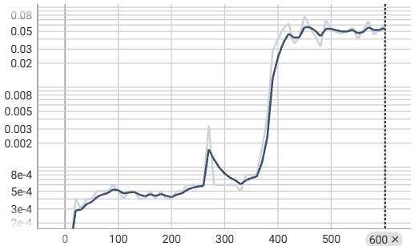 | 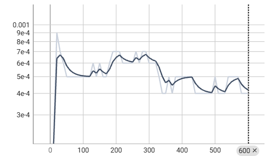 | 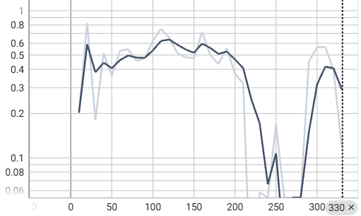 | 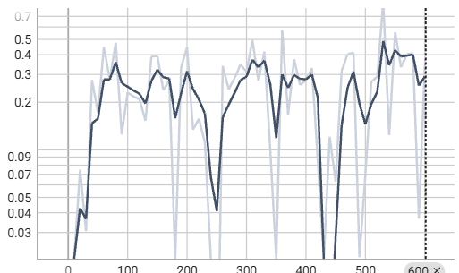 |

从 Loss 曲线中可以很明显地看出，PRM 过程奖励对提高模型收敛性有较好的影响，但 cppo 模块反而具备加剧 GRPO 不稳定性的影响。所有分组中仅使用过程奖励介入奖励函数的 `grpo-result-main` 组能够实现较为平滑的收敛，其他组都出现了不同程度的训练崩塌情况。

#### 2. 梯度范数（Gradient Norm）

梯度范数反映了训练过程中参数更新的幅度，可帮助判断训练是否稳定以及是否存在梯度爆炸/消失问题。

| `grpo-1.5b-result-only` | `grpo-1.5b-result-main` | `cppo-1.5b-result-main` | `cppo-1.5b-result-only` |
|--------------------------|--------------------------|--------------------------|---------------------------|
| 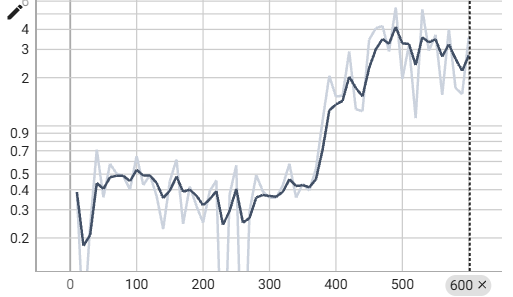 | 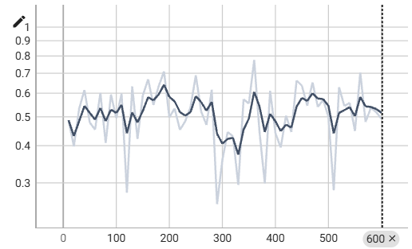 | 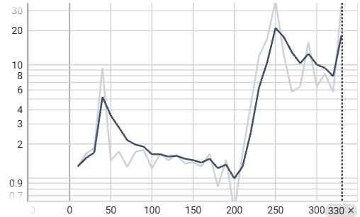 | 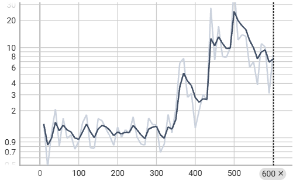 |

梯度范数的走势可以更好地帮我们理解训练崩塌的原因和过程。所有的训练崩塌全部起始于梯度范数的非常规快速爬升。且可以很明显看出，cppo 组相比 grpo 组，其梯度上升的趋势更加明显，幅度也更大。

#### 3. KL 散度走势

KL 散度衡量当前策略模型 $\pi_\theta$ 与参考模型 $\pi_{\text{ref}}$ 之间的分布差异。KL 散度过大可能导致模型遗忘预训练知识，过小则意味着策略未充分探索。

| `grpo-1.5b-result-only` | `grpo-1.5b-result-main` | `cppo-1.5b-result-main` | `cppo-1.5b-result-only` |
|--------------------------|--------------------------|--------------------------|---------------------------|
| 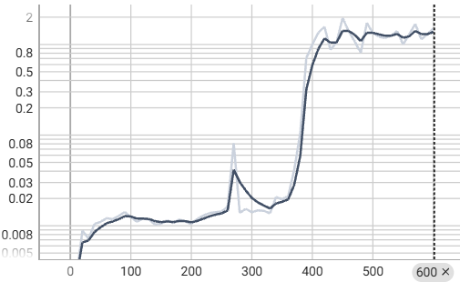 | 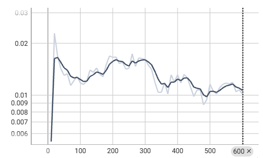 | 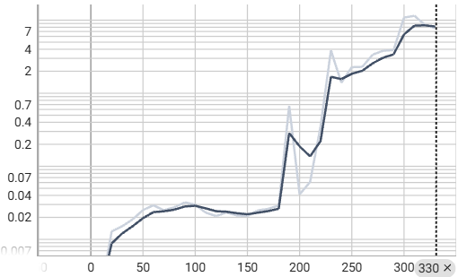 | 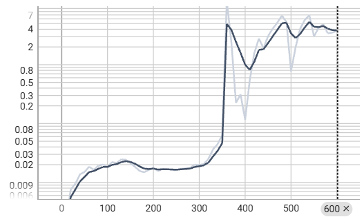 |

结合梯度范数和 KL 散度的走势，不难看出，梯度的巨变导致了 KL 散度的快速变化（以增大为主），从而使得损失函数中 KL 惩罚项急速增大，并进一步影响梯度，导致部分组出现不同程度的训练崩塌。值得一提的是，KL 散度的走势明确表现出，几乎所有组都具备一定的回调能力，能够在训练崩塌时快速反向迭代将 KL 散度在一定程度上拉回正常区间。但这一回调很大程度上是暂时的，无法改变训练后半程梯度爆炸、训练崩塌的现状。因此，对于除 `grpo-result-main` 组外的其他组，其最优 checkpoint （基于验证集平均奖励确定）往往位于训练进程的约 $\frac{1}{3}$ 到 $\frac{1}{2}$ 处，而后半段的训练几乎无用。

#### 4. 平均奖励（Mean Reward）

平均奖励反映每个训练步中采样补全的平均奖励值。在 Result-only 模式下取值范围为 $[0, 1]$，在 Full (PRM) 模式下取值范围为 $[0, \alpha+\beta]$。

| `grpo-1.5b-result-only` | `grpo-1.5b-result-main` | `cppo-1.5b-result-main` | `cppo-1.5b-result-only` |
|--------------------------|--------------------------|--------------------------|---------------------------|
| 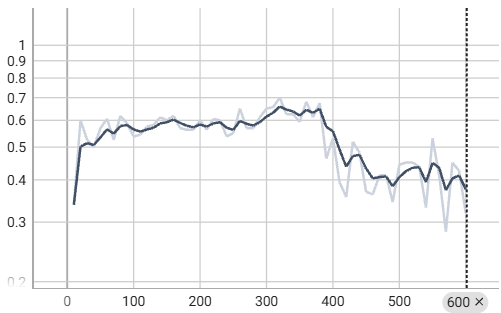 | 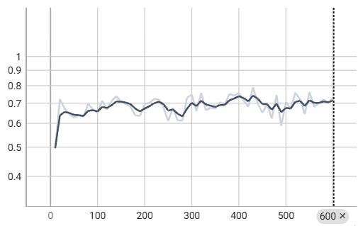 | 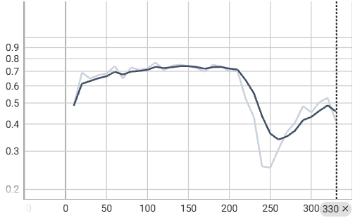 | 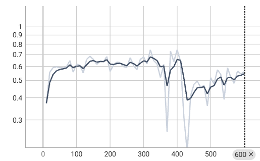 |

平均奖励的走势图映衬了梯度爆炸导致训练崩塌的情形。除 `grpo-result-main` 组相对稳定外，其他组均出现了平均奖励的截断式下降。

#### 5. 奖励标准差（Reward Std）

奖励标准差反映同一提示的 $G$ 条补全之间奖励值的离散程度，是 GRPO 组内相对优势计算的关键前提——较大的标准差意味着更清晰的正负样本区分信号。

| `grpo-1.5b-result-only` | `grpo-1.5b-result-main` | `cppo-1.5b-result-main` | `cppo-1.5b-result-only` |
|--------------------------|--------------------------|--------------------------|---------------------------|
| 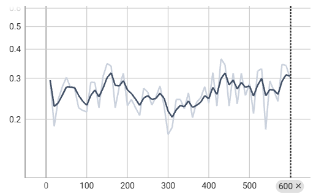 | 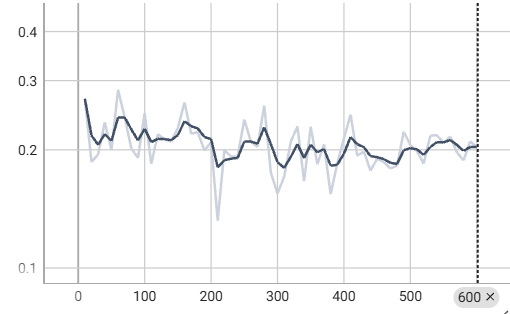 | 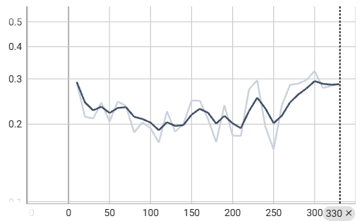 | 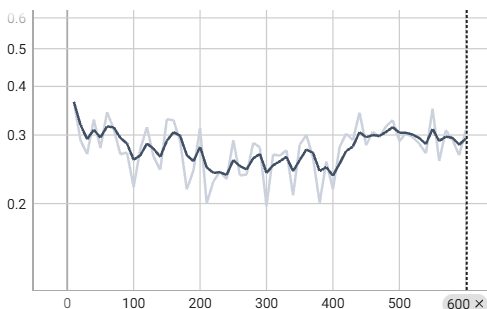 |

奖励函数标准差的走势也映衬了上述结论，仅 `grpo-result-main` 组维系了标准的波动下降式方差变化趋势。其他组均在训练后半段有不同程度的组内奖励标准差回升。

### 6. 综合分析

综合以上结果分析与过程分析，本实验从三个维度揭示了 GRPO/CPPO 训练动力学的重要规律：

**PRM 的双重收益机制。** 过程奖励的引入同时作用于"优化目标"和"优化过程"两个层面。在目标层面，PRM 将稀疏的二值结果奖励（0/1）转化为 $[0, \alpha+\beta]$ 范围内的连续信号，显著提升了组内优势估计的质量——更高的方差意味着更清晰的正负样本区分，从而为策略梯度提供了更强的方向性引导。在过程层面，连续奖励信号降低了梯度估计的方差，使优化轨迹更为平滑，这直接体现为 `grpo-result-main` 组在所有组中唯一实现了全程稳定收敛。两层收益的叠加使得 PRM 成为本实验中贡献最大的单一设计因素。

**CPPO 的放大器效应与稳定性代价。** CPPO 剪枝本质上是一种方差-偏差权衡：通过丢弃低 $|\hat{A}|$ 样本降低了梯度估计的方差，但同时也引入了选择偏差——保留的样本往往对应分布尾部（极端正确或极端错误），可能扭曲对真实梯度的估计。这一机制在训练曲线上表现为梯度范数更剧烈的波动和更早的崩塌趋势。然而，CPPO 的峰值性能优势同样源于这一机制：训练早期的优质迭代（崩塌发生前）因信噪比更高而加速了收敛，使得在相对靠前的 checkpoint 处即可达到优于 GRPO 的准确率。这与近期关于随机梯度下降中"噪声有助于逃离尖锐极小值但损害最终收敛"的理论框架一致——CPPO 通过降低噪声加速了向尖锐但泛化性差的极小值的收敛，而 GRPO 的噪声则维持了向平坦极小值搜索的可能性。

**泛化-性能权衡。** 实验数据揭示了 CPPO 存在明显的训练集过拟合倾向：`cppo-result-only` 在 MATH 上的 @1-Acc 低于 GRPO 基线（11.67% vs 12.0%），且 @3-Acc 差距更大（17.0% vs 19.0%）。这一现象可以归因于 CPPO 的选择性剪枝使模型过度适配了 GSM8K 特有的推理模式——剪枝机制持续保留对 GSM8K 奖励函数最优的补全，但这些补全的特征可能并不泛化到 MATH 的分布。PRM 在这一维度上展现出了更好的性质：其步骤级监督学到的推理过程知识具有一定的跨域迁移性，体现为 MATH 上的 @1-Steps-Acc 大幅领先（73.2% vs 60.5%）。

**训练崩塌的共同病理。** 所有非 `grpo-result-main` 组均经历了不同程度的训练崩塌，其触发路径高度一致：梯度范数的非常规爬升 → KL 散度急剧增大 → KL 惩罚项主导损失函数 → 梯度进一步恶化。这一正反馈循环的根源在于 GRPO 的 on-policy 性质：策略更新后，新的采样分布可能与参考模型分布产生显著偏移，导致 KL 散度激增。PRM 通过提供更平滑的奖励信号减弱了这一循环的触发强度，但并未从根本上消除问题。CPPO 反而加剧了这一趋势——剪枝去除了低 $|\hat{A}|$ 样本的"统计缓冲"作用，使每次更新都更激进地偏离参考分布。这一发现指向一个重要的工程权衡：当训练稳定性与峰值性能不可兼得时，优先选择稳定性（使用 PRM 的 GRPO）往往能在全局上获得更好的泛化性能，而追求峰值性能（CPPO + PRM）则需要谨慎的 checkpoint 选择策略。

## 讨论与展望

本实验通过系统的消融研究，验证了 PRM 过程奖励和 CPPO 剪枝在 GRPO 框架下的各自贡献与交互效应。实验结果表明，PRM + CPPO 的组合在 GSM8K 上取得了最优的测试准确率（@1-Acc 68.33%），但训练过程中的稳定性问题和跨数据集泛化能力的下降同样不容忽视。基于这些发现，本节提出一种改进的 CPPO 架构——**Soft-CPPO**，旨在保留 CPPO 剪枝的核心优势的同时，缓解其训练不稳定和过拟合倾向。

### Soft-CPPO：基于优势采样的软剪枝策略

标准 CPPO 采用硬剪枝（hard pruning）策略：在每个生成组中，按绝对优势 $|\hat{A}_i|$ 降序排列，仅保留前 $K = \lfloor G \times (1-P) \rfloor$ 条样本，其余样本的损失贡献直接置零。这种非此即彼的二元决策带来了两个问题：（1）丢弃的样本中可能包含有用的梯度信息，尤其是当组内优势区分度较低时；（2）保留的极端样本可能引入选择偏差，推动策略向尖锐极小值收敛，损害泛化能力。

Soft-CPPO 的核心思想是将硬剪枝替换为**基于优势幅度的概率采样**：每个样本 $i$ 以概率 $p_i$ 参与本轮梯度更新，其中 $p_i$ 是其绝对优势的单调递增函数。具体设计如下：

**1. 采样概率定义**

对于大小为 $G$ 的生成组，样本 $i$ 的参与概率定义为：

$$p_i = \lambda \cdot \frac{|\hat{A}_i|}{\sum_{j=1}^{G} |\hat{A}_j|} + (1 - \lambda) \cdot \frac{1}{G}$$

其中 $\lambda \in [0, 1]$ 为混合系数，控制硬剪枝与均匀采样之间的插值程度：
- $\lambda = 0$：所有样本等概率参与，退化为标准 GRPO；
- $\lambda = 1$：概率完全正比于 $|\hat{A}|$，优势幅度越大的样本越容易被采样；
- $\lambda \in (0, 1)$：在两者之间平滑过渡。

与标准 CPPO 的硬剪枝相比，Soft-CPPO 的采样机制具有以下优势：
- **保留低优势样本的可能性**：$|\hat{A}|$ 较小的样本仍以非零概率参与训练，起到"统计缓冲"作用，平滑梯度估计；
- **避免系统性选择偏差**：不排除任何样本，而是通过概率权重自然地强调高信号样本，降低了陷入尖锐极小值的风险；
- **可微调节**：$\lambda$ 提供了从 GRPO（$\lambda=0$）到激进剪枝（$\lambda \to 1$）的连续控制维度。

**2. KL 自适应调度**

实验表明，训练崩塌的直接前兆是 KL 散度的快速爬升。因此，Soft-CPPO 引入 KL 散度监控机制，动态调整混合系数 $\lambda$：

$$\lambda_t = \lambda_{\text{max}} \cdot \sigma\left(\kappa \cdot (\tau - \text{KL}_t)\right)$$

其中：
- $\lambda_{\text{max}} \in (0, 1]$ 为最大混合系数；
- $\text{KL}_t$ 为当前步的 KL 散度估计值；
- $\tau$ 为 KL 目标阈值（如 $\tau = 0.1$），超过此阈值时自动减弱剪枝强度；
- $\kappa$ 为敏感度参数，控制调度曲线的陡峭程度；
- $\sigma(\cdot)$ 为 sigmoid 函数。

该调度机制的含义是：当训练稳定（$\text{KL}_t \ll \tau$）时，$\lambda_t \approx \lambda_{\text{max}}$，充分发挥 CPPO 的信噪比优势；当 KL 散度逼近或超过阈值时，$\lambda_t$ 平滑衰减，自动降低剪枝强度、引入更多低优势样本，增强梯度估计的统计稳定性。这种自适应机制使 Soft-CPPO 无需人工干预即可在"探索效率"与"训练稳定性"之间动态平衡。

**3. 损失函数修正**

在 Soft-CPPO 框架下，损失函数中每个样本的贡献按其采样权重 $w_i$ 进行缩放：

$$w_i = \frac{p_i}{\frac{1}{G} \sum_{j=1}^{G} p_j}$$

最终的策略梯度损失为：

$$\mathcal{L}_{\text{Soft-CPPO}} = \frac{\sum_{i=1}^{G} w_i \cdot \mathcal{L}_i}{\sum_{i=1}^{G} w_i}$$

其中 $\mathcal{L}_i$ 为样本 $i$ 的逐 token 策略梯度损失（含 KL 正则项）。权重归一化确保了不同 $\lambda$ 下损失的量级一致性。

### 预期效果与未来验证方向

基于本实验的实证发现，Soft-CPPO 预期可在以下方面改进标准 CPPO：

1. **训练稳定性**：KL 自适应调度有望阻止训练崩塌的正反馈循环，使 CPPO 类方法在更长训练轮次中保持有效学习，而非依赖早期 checkpoint；
2. **泛化能力**：概率采样保留了低优势样本的参与，增加了优化路径中的噪声多样性，有助于搜索更平坦的极小值（flat minima），从而提升跨域泛化性能——这直接针对本实验中 CPPO 在 MATH 上出现"性能反转"的问题；
3. **超参数鲁棒性**：$\lambda$ 的动态调整降低了对初始剪枝率 $P$ 的手动调参依赖，使方法在不同奖励函数质量下均能自适应运行。

未来的验证工作可从以下方向展开：
- 在 GSM8K 上对比 Soft-CPPO（不同 $\lambda_{\text{max}}$ 和 $\kappa$ 配置）与标准 CPPO 的训练曲线和最终准确率；
- 系统评估 MATH 跨数据集泛化指标，验证概率采样是否缓解了过拟合；
- 探索更精细的 KL 调度策略（如基于 KL 变化率而非绝对值），以及将熵（entropy）纳为辅助监控信号；
- 在更大规模的数学推理数据集（如 DeepMath-103K 的完整训练集）上验证方法的可扩展性。

